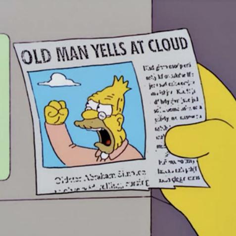

<!-- tex hacks required: remove empty frame at beginning; break line in title (Burnham ref; add \framebreak manually to refs (ugh) -->
<!-- 
apa.csl is a slightly hacked version of APA 
  (modified for "et al" after 2 authors in text)
  -->
<!-- blockquote:
  https://css-tricks.com/snippets/css/simple-and-nice-blockquote-styling/ -->
<!-- center:
    https://www.w3schools.com/howto/howto_css_image_center.asp -->
<!-- .refs is style for reference page (small text) -->
<style>
.refs {
font-size: 14px;
}
.sm_block {
 font-size: 20px;
}
h2 { 
 color: #3399ff;		
}
h3 { 
 color: #3399ff;		
}
.title-slide {
   background-color: #55bbff;
   }
blockquote {
  background: #f9f9f9;
  border-left: 10px solid #ccc;
  margin: 1.5em 10px;
  padding: 0.5em 10px;
  quotes: "\201C""\201D"
}
blockquote:before {
  color: #ccc;
  content: open-quote;
  font-size: 4em;
  line-height: 0.1em;
  margin-right: 0.25em;
  vertical-align: -0.4em;
}
blockquote p {
  display: inline;
}
.center {
    display: block;
    margin-left: auto;
    margin-right: auto;
    width: 50%;
}
</style>
<!--    content: url(https://i.creativecommons.org/l/by-sa/4.0/88x31.png)
>
<!-- Limit image width and height -->
<style type="text/css">
img {     
  max-height: 560px;     
  max-width: 700px; 
}
div#before-column p.forceBreak {
	break-before: column;
}

div#after-column p.forceBreak {
	break-after: column;
}
</style>

```{r setup, include = FALSE}
library("ggplot2"); theme_set(theme_classic())
library("reshape2")
library("ggExtra")
library("MASS")
library("knitr")
library("tidyverse")
opts_chunk$set(echo=FALSE,fig.width=4,fig.height=4,out.width=400)
load("ares_sims.rda")
```

## acknowledgements

money: NSERC

ideas: Jonathan Dushoff, Marm Kilpatrick, Brian McGill, Daniel Park, Daniel Turek

## no free lunch

- **Conjecture**: Data-driven model tuning can increase the *accuracy* of a point estimate, but cannot decrease its *uncertainty* (without further strong assumptions)
- *accuracy*: e.g. mean squared error
- *uncertainty*: e.g. width of the confidence interval

## scope of this talk

- full-rank ($p < n$), **non-sparse** problems
- science oriented (ecology/evolution) 

## what are we doing when we do statistics?

- exploration
    - look for interesting patterns
	- confirm with followup observations
- prediction
    - best guess at future outcomes under specified conditions
- inference
    - estimate effects of processes *and their uncertainty*

## terminology

\includegraphics[height=0.8\textheight]{pix/humpty2c.png}

## what do I mean by inference?

- **not** concerned with *formal* causal inference
- evaluation of uncertainty
- what would we expect to see in future data?
   - *coefficients*: uncertainty around the effect of a change in the predictors
   - *predictions*: uncertainty around the value observed for specified predictor values
   - *p-values*: uncertainty around a counterfactual null

## data-driven model tuning for point estimates {.columns-2}

\begincols
\begincol{0.5\textwidth}

- avoid omitting potentially important predictors
- avoid overfitting
- $\approx$ optimize bias-variance tradeoff

\endcol
\begincol{0.5\textwidth}

\includegraphics[width=\textwidth]{pix/330px-The_Three_Bears_-_Project_Gutenberg_eText_17034.jpg}

\tiny Rackham 1918  
\tiny [Wikipedia](https://en.wikipedia.org/wiki/Goldilocks_and_the_Three_Bears#/media/File:The_Three_Bears_-_Project_Gutenberg_eText_17034.jpg)

\endcol
\endcols

## e.g. bias-variance tradeoff in ridge regression


## data-driven tuning

- stepwise/subset regression, ridge/lasso/elastic net, random forests, boosting ...
- need to choose *appropriate* model complexity
   - model size (selection) or complexity (shrinkage)
   - estimate out-of-sample error without (explicit) cross-validation (AIC, Cp, BIC, out-of-bag error, ...)
   - or explicit cross-validation
- may need to tune model **hyperparameters** (e.g. via cross-validation)

<!-- - *note* CV usually assumes *independent* sampling  
[@wenger_assessing_2012; @roberts_cross-validation_2017] -->

## but what about uncertainty?

- statistical learning strongly focused on *prediction*
- **but** appropriate decisions require uncertainty quantification!
    - well appreciated in clinical trials
    - underappreciated in modern data science?

## how do we assess uncertainty quantification?

- false positive/type 1 error rate
- **coverage**: does an $x$% confidence interval include the true value $x$% of the time?
- (mentioned 0 $\times$ in @james_introduction_2013,  
1 $\times$ in @hastie_elements_2009)
 
## coverage example [@li_fitting_2018]


## why coverage is better than type 1 error (mini-rant) {.columns-2}
 
 \begincols
\begincol{0.7\textwidth}

- type 1 error focuses on rejecting null hypotheses
- NH ($\beta=0$) never(?) true in applied problems outside physics
- coverage reduces to type-1 error *if* $\beta=0$
- type 1 assessment encourages unrealistic simulation setups
 
\endcol
\begincol{0.3\textwidth}


\endcol
\endcols

 
## naive selection methods

Post-selection inference that *ignores the selection process* is always be overoptimistic

- @altman_bootstrap_1989

> Any form of data-dependent variable selection is likely to lead to overoptimistic goodness of fit; we expect a worse fit to a new set of data; bootstrapping with stepwise variable selection gave similar individual predictions but larger confidence intervals for estimated survival probabilities.

See also @harrell_problems_1996.

## for example ... 

AIC-stepwise regression, simulated data  
`lm(y ~ .)` + `step()`  
$n=100$, $p=90$, $\beta \sim U(-1,1)$, $\sigma^2_r=5$; 90% CIs

\includegraphics[height=0.6\textwidth]{pix/stepcoef.png}

cf. @freedman_note_1983

## coverage results (90% CIs)

```{r}
knitr::kable(allres_step_tbl, digits = 3)
```

## what about something smarter, e.g. ridge regressoin?

- @obenchain_classical_1977: properly constructed CI width $\geq$ full least-squares CI
- other methods may give OK results (e.g. @crivelli_confidence_1995, @macneill_confidence_1987, @efron_automatic_2020)
   - often involve *additional assumptions* - e.g. on the distribution of parameters
   - bootstrapping methods must incorporate the *full tuning process*

## multimodel averaging (MMA)

- various methods for constructing MMA CIs [@burnham_model_2002;@fletcher2012model;@kabaila_model-averaged_2016]
- MMA CIs are generally **too narrow**  
[@turek2013frequentist;@kabaila_model-averaged_2016;@dormann_model_2018] but cf. @burnham_model_2002

## MMA results (@dormann_model_2018, Figure 5)

\includegraphics[width=\textwidth]{pix/dormann_coverage.png}

## What about post-selection inference?

- Lots of exciting work 
- focused on high dimensions, depends on strong assumptions
    - sparsity
	- coefficient gap (minimum size of smallest $|\beta|$)
	- asymptopia
- e.g. @dezeure_high-dimensional_2015:

> When the truth (or the linear approximation of the true model) is nonsparse, the methods are expected to break down ...

- See Cosma Shalizi's notes at {\small <http://bactra.org/notebooks/post-model-selection-inference.html>}

## paying for lunch in other ways

- go Bayesian! 
    - Bayesian CIs are well-calibrated *by definition*, conditional on the model and the priors ...  
[@gelman_avoiding_1995; @cook_validation_2006; @talts_validating_2020]
- pseudo-Bayesian assumptions about effect size distributions

## conclusions: what should you do?

- for **inference**:
    - use the full model
    - *a priori* model reduction [@harrell_regression_2001]
- for **prediction**:
    - use CIs from shrinkage estimates with caution
    - use non-neutral, informative Bayesian priors?  
[@crome_novel_1996]

## there ain't no such thing as a free lunch ...


## (blank)

## what are multifactorial systems?

- many processes contribute to pattern
- quantify *how* each process affects the system,  
rather than testing *whether* we can detect its impact
<!--
<blockquote>
... the measure of participation of each [process] must be determined before a satisfactory elucidation can be reached. The full solution therefore involves not only a recognition of multiple participation but an estimate of the measure and mode of each participation ...
</blockquote>
-->
- related:
    - Chamberlin's \cemph{method of multiple working hypotheses}
[@raup_method_1995]
    - \cemph{tapering effect sizes} [@burnham_model_2002]

## conceptual problem: discretization {.columns-2}

\begincols

\begincol{0.5\textwidth}

- model selection, or evidential statistics [@taper_evidential_2016], focus on differentiating **discrete** hypotheses/models
- submodels are always straw men
- expand models to cover the whole space

\endcol
\begincol{0.5\textwidth}

\pause
\includegraphics[width=\textwidth]{pix/eyam_ternary.png}

{\small Estimated contribution of plague transmission modes in Eyam 1665}

\endcol
\endcols

## References {.refs .columns-2 .allowframebreaks}

\tiny

