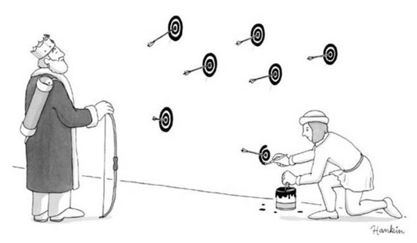

<!-- tex hacks required: remove empty frame at beginning; break line in title (Burnham ref; add \framebreak manually to refs (ugh) -->
<!-- 
apa.csl is a slightly hacked version of APA 
  (modified for "et al" after 2 authors in text)
  -->
<!-- blockquote:
  https://css-tricks.com/snippets/css/simple-and-nice-blockquote-styling/ -->
<!-- center:
    https://www.w3schools.com/howto/howto_css_image_center.asp -->
<!-- .refs is style for reference page (small text) -->
<style>
.refs {
font-size: 14px;
}
.sm_block {
 font-size: 20px;
}
h2 { 
 color: #3399ff;		
}
h3 { 
 color: #3399ff;		
}
.title-slide {
   background-color: #55bbff;
   }
blockquote {
  background: #f9f9f9;
  border-left: 10px solid #ccc;
  margin: 1.5em 10px;
  padding: 0.5em 10px;
  quotes: "\201C""\201D"
}
blockquote:before {
  color: #ccc;
  content: open-quote;
  font-size: 4em;
  line-height: 0.1em;
  margin-right: 0.25em;
  vertical-align: -0.4em;
}
blockquote p {
  display: inline;
}
.center {
    display: block;
    margin-left: auto;
    margin-right: auto;
    width: 50%;
}
</style>
<!--    content: url(https://i.creativecommons.org/l/by-sa/4.0/88x31.png)
>
<!-- Limit image width and height -->
<style type="text/css">
img {     
  max-height: 560px;     
  max-width: 700px; 
}
div#before-column p.forceBreak {
	break-before: column;
}
div#after-column p.forceBreak {
	break-after: column;
}
</style>

```{r setup,echo=FALSE,message=FALSE}
library("ggplot2"); theme_set(theme_classic())
library("reshape2")
library("ggExtra")
library("MASS")
library("knitr")
opts_chunk$set(echo=FALSE,fig.width=4,fig.height=4,out.width=400)
```

## acknowledgements

money: NSERC

ideas: Jonathan Dushoff, Marm Kilpatrick, Brian McGill, Daniel Park, Daniel Turek, Florian Hartig, Carsten Dormann ...

## what are multifactorial systems?

- many processes contribute to a pattern
- quantify *how* each process affects the system,  
rather than testing *whether* we can detect its impact

\vskip25pt

<blockquote>
... the measure of participation of each [process] must be determined before a satisfactory elucidation can be reached. The full solution therefore involves not only a recognition of multiple participation but an estimate of the measure and mode of each participation ...
</blockquote>

Chamberlin in @raup_method_1995

## the bottom line(s) {.columns-2}

\begincols
\begincol{0.5\textwidth}

* you can improve accuracy **but not certainty** by data-driven model selection
* DDMS messes up inference
* testing discrete hypotheses (e.g. AIC tables) is silly

*Recommendation*: use a sensible "full" (not maximal) model

\endcol
\begincol{0.5\textwidth}


\endcol
\endcols

## why select models? {.columns-2}

\begincols
\begincol{0.5\textwidth}

- too many predictors, not enough data
- don't neglect important predictors
- avoid overfitting
- **bias-variance tradeoff**

\endcol
\begincol{0.5\textwidth}

\includegraphics[width=\textwidth]{pix/330px-The_Three_Bears_-_Project_Gutenberg_eText_17034.jpg}

\tiny Rackham 1837

\endcol
\endcols

## data-driven model selection is widely espoused


@crawley_statistics_2011 
 
\includegraphics[width=2in]{pix/crawley_mam.png} |


@zuur_mixed_2009 

also @quinn_experimental_2002, others ...

## DDMS is a QRP


## DDMS violates assumptions



---


## can we just avoid *stepwise* methods?

- all-subsets > backward selection > forward selection
- ... doesn't solve the fundamental problem
- what about **model averaging**?

## information-theoretic methods

\includegraphics[width=0.325\textwidth]{pix/akaike_crop.jpg} \includegraphics[width=0.4\textwidth]{pix/DA-KB-GW.jpg}

- *Akaike information criteria* etc.
- into E&E from wildlife ecology: focus on prediction
- metrics of *expected predictive accuracy*
- choosing best-AIC model alone is problematic

## multimodel averaging [@burnham_model_2002]

- typical approach
    - fit full model; "dredge"; compute AIC weights
    - present table of models with $\Delta$AIC & weights
    - compute model-averaged point estimates and CIs
- **many** ways to do it wrong  
e.g. @cade_model_2015; @brewer_relative_2016; @galipaud_ecologists_2014

## this doesn't fix the problem

\includegraphics[width=\textwidth]{pix/dormann_coverage.png}

@dormann_model_2018, Figure 5

... also @turek2013frequentist, @kabaila_model-averaged_2016

## shrinkage estimators

- MMA is a *shrinkage estimator*                                    
- pulls all estimates toward zero, avoids overfitting
- strength of shrinkage usually *chosen from the data* (!!)
- (much) more efficient than dredging+MMA
- post-selection inference is really, really hard: strong assumptions [@zhao_defense_2017;lee_exact_2013;dezeure_high_2015]

## what about AIC for variable importance?

\includegraphics[height=0.8\textheight]{pix/karelus.png}

@karelus_effects_2017

## why? {.columns-2 .build}

Back to multifactorial systems. What are we trying to do?

* quantify magnitudes accurately (and precisely)
    * parameter values, effect sizes, predictions ...
	* "guarder males are 22% more active than sneakers"
	* "polar bear populations will shrink by 23%"
	* "fire frequency explains 3% of global variation in plant diversity"
* quantify uncertainty accurately
    * p-values (clarity)
	* confidence intervals
* estimate variable importance
        
## conceptual problem: discretization {.build .columns-2}

\begincols

\begincol{0.5\textwidth}

- IT approaches often framed as good for multiple hypotheses [@elliott_revisiting_2007;richards_model_2011]
- but IT focuses on differentiating **discrete** hypotheses/models
- submodels are always straw men

\endcol
\begincol{0.5\textwidth}

\pause
\includegraphics[width=\textwidth]{pix/eyam_ternary.png}

{\small Estimated contribution of plague transmission modes in Eyam 1665}

\endcol
\endcols

## possible reactions

- "MMA CIs only undercover a little bit"
    - then they're not good CIs; increased certainty is an illusion
- "I'm only interested in prediction"
    - really?
    - do you want reliable CIs on your predictions?
- "I want to test multiple hypotheses"
    - fine to test *clarity* of multiple hypotheses within full-model context
    - ``which discrete hypothesis is best?'' *usually* not our real question

## recommendations

- for **inference**:
    - *a priori* model reduction [@harrell_regression_2001]
    - inference based on full model
    - variable importance based on scaled predictors; maybe partial $R^2$ [@jaeger_r2_2017;@r2glmm]... ?
- for **prediction**:
    - modern shrinkage methods probably > MMA
    - CIs unreliable

## loose ends

- is it OK to select on non-focal parts of the model?
    - interaction
    - random effects in mixed models
- Bayesian approaches

## References {.refs .columns-2 .allowframebreaks}

\tiny
