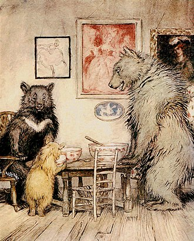
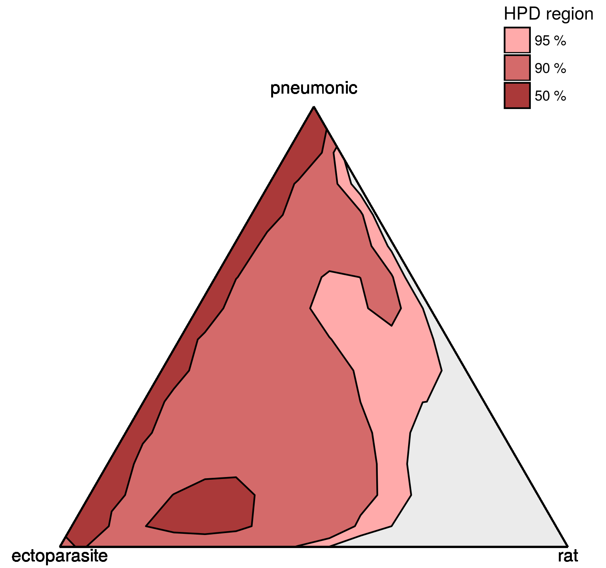
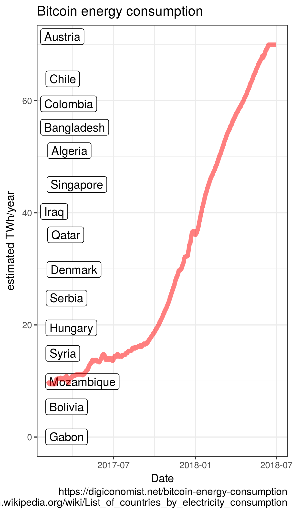
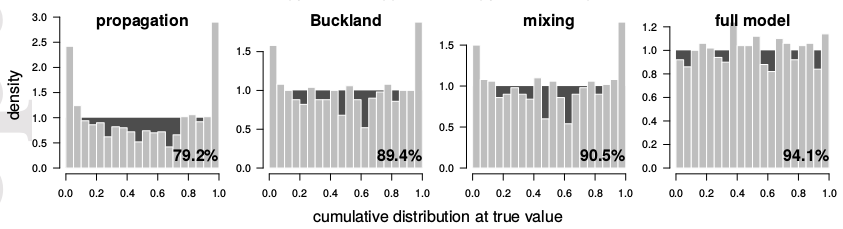

<!-- 
apa.csl is a slightly hacked version of APA 
  (modified for "et al" after 2 authors in text)
  -->
<!-- blockquote:
  https://css-tricks.com/snippets/css/simple-and-nice-blockquote-styling/ -->
<!-- center:
    https://www.w3schools.com/howto/howto_css_image_center.asp -->
<!-- .refs is style for reference page (small text) -->
<style>
.refs {
font-size: 14px;
}
.sm_block {
 font-size: 20px;
}
h2 { 
 color: #3399ff;		
}
h3 { 
 color: #3399ff;		
}
.title-slide {
   background-color: #55bbff;
   }
blockquote {
  background: #f9f9f9;
  border-left: 10px solid #ccc;
  margin: 1.5em 10px;
  padding: 0.5em 10px;
  quotes: "\201C""\201D"
}
blockquote:before {
  color: #ccc;
  content: open-quote;
  font-size: 4em;
  line-height: 0.1em;
  margin-right: 0.25em;
  vertical-align: -0.4em;
}
blockquote p {
  display: inline;
}
.center {
    display: block;
    margin-left: auto;
    margin-right: auto;
    width: 50%;
}
</style>
<!--    content: url(https://i.creativecommons.org/l/by-sa/4.0/88x31.png)
>
<!-- Limit image width and height -->
<style type="text/css">
img {     
  max-height: 560px;     
  max-width: 700px; 
}
div#before-column p.forceBreak {
	break-before: column;
}

div#after-column p.forceBreak {
	break-after: column;
}
</style>

```{r setup,echo=FALSE,message=FALSE}
library("ggplot2"); theme_set(theme_classic())
library("reshape2")
library("ggExtra")
library("MASS")
library("knitr")
opts_chunk$set(echo=FALSE,fig.width=4,fig.height=4,out.width=400)
```

## what are multifactorial systems?

- many processes contribute to pattern
- quantify *how* each process affects the system,  
rather than testing *whether* we can detect its impact
<!--
<blockquote>
... the measure of participation of each [process] must be determined before a satisfactory elucidation can be reached. The full solution therefore involves not only a recognition of multiple participation but an estimate of the measure and mode of each participation ...
</blockquote>
-->
- related:
    - Chamberlin's <font color="red">method of multiple working hypotheses</font>  
[@raup_method_1995]
    - <font color="red">tapering effect sizes</font> [@burnham_model_2002]

This talk is mostly about *inferential* or *scientific* questions  
(but also applies to prediction/management)

## what is multimodel averaging  (MMA)?<br>[@burnham_model_2002]

- typical approach
    - fit full model; dredge; compute AIC weights
    - present table of models/$\Delta$AIC/weights
    - compute model-averaged point estimates and CIs
- **many** ways to do it wrong  
e.g. @cade_model_2015; @brewer_relative_2016; @galipaud_ecologists_2014
     - ... but let's not worry about that now

## why use MMA? {.columns-2}

> - avoid omitting potentially important predictors
> - avoid overfitting
> - $\approx$ optimize bias-variance tradeoff
> - avoid stepwise approaches & pairwise comparisons
> - MMA is a **shrinkage estimator** [@dahlgren_alternative_2010]



<font size="4px">Rackham 1837</font>

## why *not* use MMA?

three problems:

- conceptual
- computational
- inferential

## conceptual problem: discretization {.build .columns-2}

- information-theoretic (IT) approaches often framed as descendants of Chamberlin [@elliott_revisiting_2007]
- but IT focuses on differentiating **discrete** hypotheses/models
- submodels are always straw men
- ¿ does this actually cause problems ?



<font size="4px">Estimated contribution of plague transmission modes in Eyam 1665</font>

## computational problem: efficiency {.columns-2}

\newcommand{\bigO}{{\mathcal{O}}}

- classic MMA requires fitting **lots** of models: $\bigO(2^K K^2 n)$
- more efficient shrinkage estimators:  
lasso/ridge/etc.; random forest etc.; Bayesian + regularizing priors
- $\bigO(K^2 n)$ or $\bigO(K n \log(n))$  
[@hardy_machine_2017; @louppe_understanding_2014]  
(may need to tune shrinkage)
- we do have lots of computers ...



## inferential problem: undercoverage

- various methods for constructing MMA CIs [@burnham_model_2002;@fletcher2012model;@kabaila_model-averaged_2016]
- MMA CIs are generally **too narrow**  
[@turek2013frequentist;@kabaila_model-averaged_2016;@dormann_model_2018] but cf. @burnham_model_2002
- general property of shrinkage estimators? e.g. ridge-regression CI width $\geq$ least-squares CI [@obenchain_classical_1977]
- **no free lunch**; can we ever gain certainty by shrinkage?

<div class="center">

<font size="4px">@dormann_model_2018, Figure 5</font>
</div>

## possible reactions

- "MMA CIs only undercover a little bit"
    - then they're not good CIs; increased certainty is an illusion
- "I'm only interested in prediction"
    - really?
    - do you want reliable CIs on your predictions?
- "MMA is the only shrinkage estimator available for my problem"
    - let's work on this	
	
## conclusions: what should you do?

- for **inference**:
    - use the full model
    - *a priori* model reduction [@harrell_regression_2001]
- for **prediction**:
    - beware CIs from shrinkage estimates
    - help develop efficient, principled shrinkage estimation methods
    - use non-neutral, informative Bayesian priors?  
[@crome_novel_1996]

##

<div class="center">

<font size="4px">https://imgflip.com</font>
</div>

## References {.refs .columns-2}

